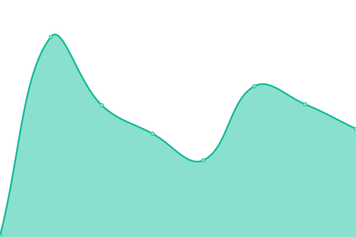

# [📈 Live Status](https://demo.upptime.js.org): <!--live status--> **🟩 All systems operational**

This repository contains the open-source uptime monitor and status page for [uptimey](https://demo.upptime.js.org), powered by [Upptime](https://github.com/upptime/upptime).

<!--start: status pages-->
<!-- This summary is generated by Upptime (https://github.com/upptime/upptime) -->
<!-- Do not edit this manually, your changes will be overwritten -->
<!-- prettier-ignore -->
| URL | Status | History | Response Time | Uptime |
| --- | ------ | ------- | ------------- | ------ |
|  [JustPerfectHome](https://www.justperfecthome.com) | 🟩 Up | [just-perfect-home.yml](https://github.com/uptimey/upptime/commits/HEAD/history/just-perfect-home.yml) | 

 2147ms
     
 | 

<a href="https://uptimey.github.io/upptime/history/just-perfect-home">100.00%</a>
    

|  [Alexs Portfolio](https://panluvme.github.io/) | 🟩 Up | [alexs-portfolio.yml](https://github.com/uptimey/upptime/commits/HEAD/history/alexs-portfolio.yml) | 

 115ms
     
 | 

<a href="https://uptimey.github.io/upptime/history/alexs-portfolio">100.00%</a>
    

<!--end: status pages-->

[**Visit our status website →**](https://demo.upptime.js.org)

## 📄 License

- Powered by: [Upptime](https://github.com/upptime/upptime)
- Code: [MIT](./LICENSE) © [Anand Chowdhary](https://anandchowdhary.com), supported by [Pabio](https://pabio.com)
- Data in the `./history` directory: [Open Database License](https://opendatacommons.org/licenses/odbl/1-0/)
