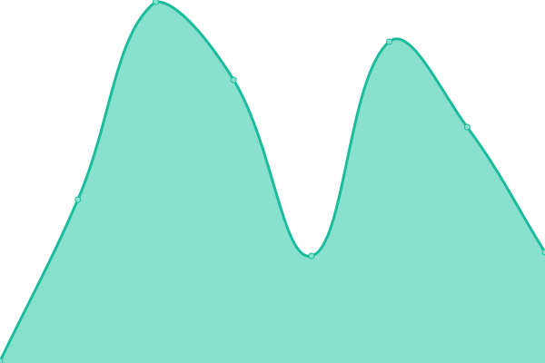
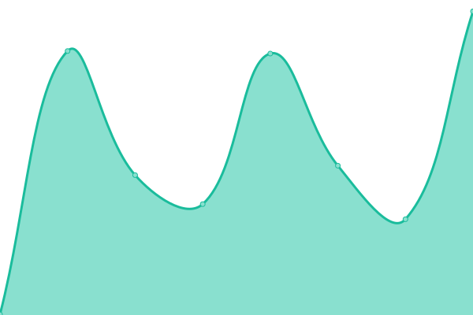

# [📈 Live Status](https://demo.upptime.js.org): <!--live status--> **🟧 Partial outage**

<!--start: status pages-->
<!-- This summary is generated by Upptime (https://github.com/upptime/upptime) -->
<!-- Do not edit this manually, your changes will be overwritten -->
<!-- prettier-ignore -->
| URL | Status | History | Response Time | Uptime |
| --- | ------ | ------- | ------------- | ------ |
|  [Alexs Portfolio](https://panluvme.github.io/) | 🟩 Up | [alexs-portfolio.yml](https://github.com/uptimey/upptime/commits/HEAD/history/alexs-portfolio.yml) | 

 88ms
     
 | 

<a href="https://uptimey.github.io/upptime/history/alexs-portfolio">100.00%</a>
    

|  [Alexs Dashboard](https://dash.pandashii.com/) | 🟥 Down | [alexs-dashboard.yml](https://github.com/uptimey/upptime/commits/HEAD/history/alexs-dashboard.yml) | 

 364ms
     
 | 

<a href="https://uptimey.github.io/upptime/history/alexs-dashboard">89.44%</a>
    

<!--end: status pages-->

[**Visit our status website →**](https://uptimey.github.io/upptime)
